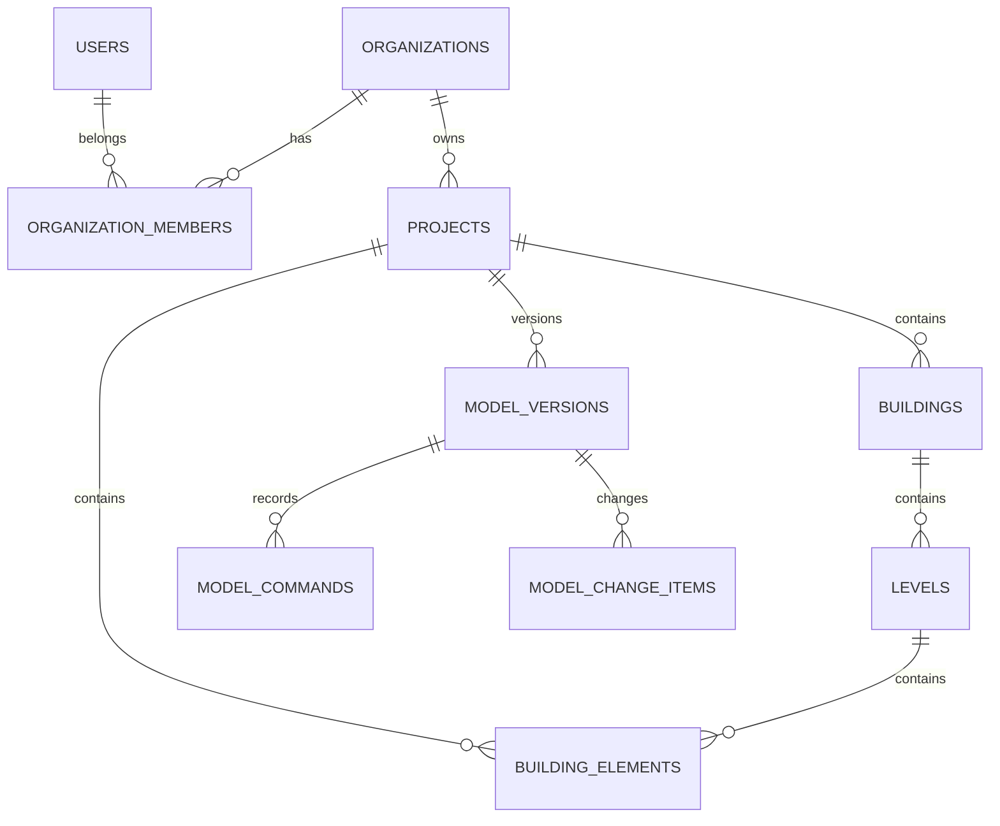
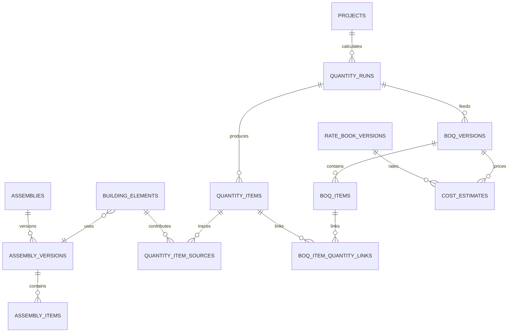
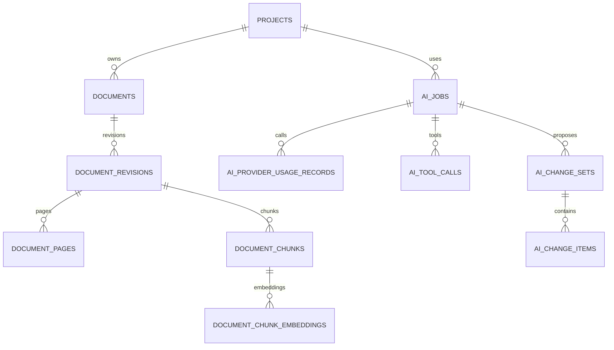
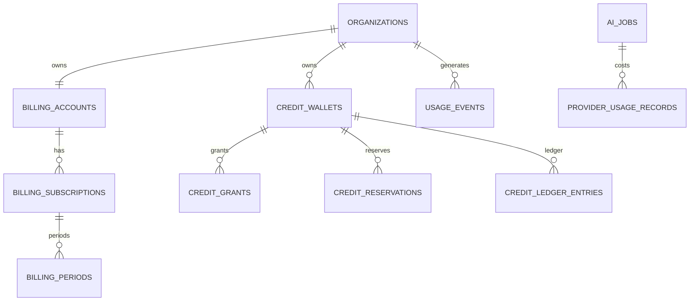

# BuildWise — Comprehensive Database & Data Architecture

> **File name:** `BuildWise_Database_Architecture.md`
>
> **Purpose:** Canonical database and data architecture for the BuildWise multi-tenant SaaS platform.
>
> **Primary transactional database:** PostgreSQL
>
> **ORM / migrations:** Drizzle ORM + Drizzle Kit
>
> **Supporting data systems:** Redis, Cloudflare R2 / S3-compatible object storage, pgvector, PostGIS, Temporal
>
> **Applies to:** identity, tenancy, projects, Building Model, versioning, 2D/3D, BIM, QS, BOQ, cost, documents, RAG, AI, billing, credits, workflows, collaboration, reporting, notifications, audit, operations and analytics.
>
> **Architecture status:** Canonical unless superseded by an approved ADR.
>
> **Target:** PostgreSQL 17+ compatible baseline. Do not introduce PostgreSQL-version-specific features that prevent the agreed production provider/version from running without an ADR.

---

# 1. Purpose

BuildWise is not a conventional CRUD SaaS.

The database must support:

```text
Multi-tenant SaaS
+
Parametric building models
+
2D / 3D synchronization
+
Model revisions
+
Quantity surveying
+
BOQ
+
Costing
+
AI actions
+
Documents / RAG
+
BIM / IFC
+
Subscriptions
+
Usage credits
+
AI token/provider cost
+
Collaboration
+
Auditability
```

The database architecture must therefore optimize for:

1. correctness,
2. traceability,
3. tenant isolation,
4. reproducibility,
5. model versioning,
6. safe concurrency,
7. predictable performance,
8. operational simplicity for a solo developer,
9. future scale without premature complexity.

---

# 2. Core Data Architecture

BuildWise uses different storage systems for different types of data.

```text
                         BUILDWISE DATA

                              │
          ┌───────────────────┼───────────────────┐
          │                   │                   │
          ▼                   ▼                   ▼
     PostgreSQL             Redis             R2 / S3
     Authoritative         Ephemeral          Large blobs
     relational data       distributed        documents
     domain state          state/cache        renders
     billing ledgers       rate limits        BIM files
     model metadata        presence           reports
          │
          ├───────────────┐
          │               │
          ▼               ▼
       PostGIS         pgvector
       site/GIS        semantic search
       geography       embeddings

                              │
                              ▼
                           Temporal
                      workflow history /
                     durable orchestration
```

---

# 3. Storage Responsibility

## PostgreSQL

Authoritative for:

- users
- organizations
- memberships
- projects
- permissions
- Building Model current state
- Building Model versions
- command journal
- element relationships
- materials
- assemblies
- quantities
- BOQ
- costs
- rate books
- document metadata
- RAG chunk metadata
- AI jobs
- AI actions
- AI usage
- billing
- credits
- invoices/payment mirrors
- subscriptions
- audit records
- report metadata
- workflow references
- notifications
- feature flags
- operational state

---

## Redis

Ephemeral only:

- caches
- rate limits
- distributed locks where justified
- collaboration presence
- short-lived editor/session state
- temporary idempotency acceleration
- short-lived AI throttling counters

Redis is **not** the system of record.

Deleting Redis must not destroy:

- a project,
- Building Model,
- BOQ,
- credits,
- subscription,
- invoice,
- model revision.

---

## Object Storage

R2/S3 stores:

- PDFs
- images
- IFC
- DWG/DXF
- GLB/glTF
- Fragments
- textures
- large model snapshots if needed
- renders
- videos
- exported reports
- imported supplier documents

PostgreSQL stores metadata and object keys.

Do not store large binary files in ordinary PostgreSQL rows.

---

# 4. Key Architectural Decisions

## 4.1 One primary PostgreSQL database initially

Use one managed PostgreSQL database for the modular monolith.

Do not create:

```text
one database per module
one database per tenant
one database per project
```

during the MVP.

This provides:

- simple transactions,
- simple backups,
- simple joins,
- easier debugging,
- lower cost,
- easier migrations.

Service/database extraction can happen later if measured scale requires it.

---

# 5. PostgreSQL Schema Strategy

For the first production version, use:

```text
one PostgreSQL database
+
one primary application schema
```

with strong table naming and module ownership.

Avoid creating many PostgreSQL schemas only for aesthetic separation.

Logical ownership lives in:

```text
Drizzle schema folders
NestJS bounded contexts
database documentation
```

Future PostgreSQL schemas can be introduced where operational or permission boundaries justify them.

---

# 6. Database Naming Standard

Tables:

```text
snake_case plural
```

Examples:

```text
organizations
organization_members
projects
building_elements
model_versions
quantity_runs
boq_items
credit_ledger_entries
```

Columns:

```text
snake_case
```

Examples:

```text
organization_id
project_id
created_at
updated_at
model_version
```

Indexes:

```text
idx_<table>_<purpose>
```

Unique indexes:

```text
uq_<table>_<purpose>
```

Foreign keys:

```text
fk_<table>_<column>
```

Constraints:

```text
ck_<table>_<rule>
```

---

# 7. Primary Key Strategy

Recommended production default:

```text
UUID primary keys
```

Prefer application-generated time-sortable UUIDs such as UUIDv7 if the chosen library is stable and standardized within the project.

Fallback:

```text
UUIDv4
```

Do not mix ID strategies casually.

## Public IDs

If human-readable support IDs are desired, add:

```text
public_id
```

Example:

```text
PRJ-8K4D2A
```

as a unique secondary identifier.

Do not make a display/reference code the relational primary key.

> Note: Earlier CRUD examples using prefixed varchar primary keys were illustrative. This database architecture is the recommended production schema direction; confirm the final ID strategy in an ADR before the first production migration.

---

# 8. Numeric Identifier Rules

Use:

```text
UUID
```

for entities.

Use:

```text
BIGINT
```

for monotonic counters such as:

- model version
- sequence numbers
- token counts where needed
- high-volume event sequence

Use:

```text
NUMERIC
```

for:

- money
- rates
- exact percentages where required
- financial calculations

Never use floating-point database types for authoritative money.

---

# 9. Timestamp Standard

Use:

```text
TIMESTAMPTZ
```

for event timestamps.

Common:

```text
created_at
updated_at
deleted_at
processed_at
expires_at
```

Application/API uses UTC ISO 8601.

Do not store local formatted date strings.

---

# 10. Tenant Model

Primary SaaS tenant:

```text
organization
```

Architecture:

```text
User
  │
  ├── Membership ── Organization
  │                     │
  │                     ├── Projects
  │                     ├── Billing Account
  │                     ├── Credits
  │                     └── Shared Libraries
```

Users can belong to multiple organizations.

---

# 11. Tenant Ownership Rule

Every tenant-owned record must be:

1. directly tagged with `organization_id`, or
2. reachable through a parent whose organization ownership is unambiguous.

For high-risk/high-volume tables, prefer a direct:

```text
organization_id
```

even when derivable from `project_id`.

Why?

- simpler tenant filtering,
- easier RLS,
- easier indexes,
- safer admin/support queries,
- less cross-tenant leakage risk.

---

# 12. Tenant Scoping Rule

Every repository query must scope tenant data.

Preferred:

```text
WHERE organization_id = :organizationId
AND id = :id
```

Not:

```text
WHERE id = :id
```

for tenant-owned tables.

---

# 13. Row-Level Security Strategy

Use two defenses:

```text
Application-level tenant scoping
+
PostgreSQL RLS where appropriate
```

## Phase 1 — Development

Mandatory:

- repository-level tenant scoping,
- cross-tenant tests.

## Phase 2 — Before paid production beta

Recommended:

- enable RLS on the most sensitive tenant-owned tables,
- validate pooled-connection behaviour carefully.

Candidate tables:

```text
projects
project_members
documents
building_elements
model_versions
comments
billing customer read tables where appropriate
```

Billing system/background/admin operations may use explicitly privileged DB roles rather than ordinary tenant RLS context.

---

# 14. RLS Context Pattern

If RLS is enabled using application context:

```sql
SET LOCAL app.current_organization_id = '...';
SET LOCAL app.current_user_id = '...';
```

inside a transaction.

Policy concept:

```sql
USING (
  organization_id::text =
  current_setting(
    'app.current_organization_id',
    true
  )
)
```

Use transaction-local settings with pooled connections.

Never rely on an unscoped session variable persisting safely across pooled requests.

---

# 15. RLS Warning

RLS is defense-in-depth.

It does not replace:

- application authorization,
- role policies,
- project-specific permissions,
- tests.

Database owners and roles with `BYPASSRLS` can bypass policies, so application roles/privileges must be designed deliberately.

---

# 16. Identity Tables

## users

```text
id UUID PK
email_normalized
display_name
avatar_url
status
locale
timezone
created_at
updated_at
deleted_at
```

Avoid storing auth-provider passwords.

---

# 17. Auth Identities

```text
auth_identities
---------------
id
user_id
provider
provider_subject
email_at_provider
created_at
updated_at
```

Unique:

```text
(provider, provider_subject)
```

Supports future provider replacement or multiple identity methods.

---

# 18. Organizations

```text
organizations
-------------
id
name
slug
status
country_code
default_currency
default_unit_system
created_by_user_id
created_at
updated_at
deleted_at
```

---

# 19. Organization Membership

```text
organization_members
--------------------
id
organization_id
user_id
role
status
joined_at
created_at
updated_at
```

Unique:

```text
organization_id + user_id
```

Roles initially:

```text
owner
admin
member
viewer
```

---

# 20. Organization Invitations

```text
organization_invitations
------------------------
id
organization_id
email_normalized
role
token_hash
invited_by_user_id
expires_at
accepted_at
revoked_at
created_at
```

Never store invitation token plaintext if avoidable.

---

# 21. Organization Settings

```text
organization_settings
---------------------
organization_id PK/FK
default_currency
default_unit_system
default_country_code
default_locale
default_timezone
settings_jsonb
updated_at
```

Only flexible/non-critical preferences go into `settings_jsonb`.

---

# 22. Project Tables

## projects

```text
id
organization_id
public_id
name
description
status
project_type
location_text
country_code
currency
unit_system
current_model_version BIGINT
created_by_user_id
created_at
updated_at
archived_at
deleted_at
```

Index:

```text
(organization_id, updated_at DESC)
```

Partial index may later cover:

```text
WHERE deleted_at IS NULL
```

only if measured query patterns justify it.

---

# 23. Project Status

Use a controlled enum/domain:

```text
draft
active
archived
deleting
deleted
```

Do not overload `deleted_at` to represent every project lifecycle state.

---

# 24. Project Members

Organization membership can give default access.

For project-specific access:

```text
project_members
---------------
id
organization_id
project_id
user_id
role
created_at
updated_at
```

Use only when per-project restrictions are needed.

Do not duplicate every organization member into every project automatically unless required.

---

# 25. Project Settings

```text
project_settings
----------------
project_id
organization_id
country_code
currency
unit_system
cost_region_code
default_waste_profile_id
project_timezone
settings_jsonb
updated_at
```

---

# 26. Project Sequence / Reference Numbers

If customer-facing sequence values are needed:

```text
project_number_sequences
```

or organization-level counters.

Do not use database row IDs as invoice/project display numbers.

---

# 27. Site Model

```text
sites
-----
id
organization_id
project_id
name
address_text
latitude
longitude
postgis_point
plot_boundary
elevation_reference
properties_jsonb
created_at
updated_at
```

Real-world geographical coordinates use PostGIS.

Internal building geometry does **not** use PostGIS as its primary representation.

---

# 28. Geography vs Building Coordinates

Keep separate coordinate spaces.

```text
Site geography
→ longitude/latitude / PostGIS / CRS

Building geometry
→ local Cartesian coordinates in millimetres
```

Store a transform/origin when mapping the building into real-world coordinates.

Do not mix lat/long degrees with building millimetres.

---

# 29. Buildings

A project can eventually have multiple buildings.

```text
buildings
---------
id
organization_id
project_id
site_id
name
building_type
origin_x_mm
origin_y_mm
origin_z_mm
rotation_deg
properties_jsonb
created_at
updated_at
```

---

# 30. Levels

```text
levels
------
id
organization_id
project_id
building_id
name
sequence
elevation_mm
height_mm
created_model_version
updated_model_version
created_at
updated_at
```

Unique where sensible:

```text
building_id + sequence
```

---

# 31. Canonical Building Element Table

Recommended hybrid schema:

```text
building_elements
-----------------
id
organization_id
project_id
building_id
level_id nullable
element_type
host_element_id nullable
parent_element_id nullable
name
classification_code nullable
assembly_version_id nullable

geometry_schema_version
geometry_jsonb

properties_schema_version
properties_jsonb

source_kind
source_ref nullable
confidence nullable
verification_status

created_model_version
updated_model_version
deleted_model_version nullable

created_by_user_id
updated_by_user_id

created_at
updated_at
deleted_at
```

---

# 32. Why Hybrid Relational + JSONB

Keep relational columns for:

- ownership,
- project,
- level,
- type,
- host,
- assembly,
- version,
- source,
- status.

Use schema-versioned JSONB for flexible parametric geometry/properties.

Example Wall geometry:

```json
{
  "start": [1200, 4500],
  "end": [6400, 4500],
  "heightMm": 2700,
  "thicknessMm": 200
}
```

Example Door:

```json
{
  "hostWallId": "...",
  "offsetMm": 1350,
  "widthMm": 900,
  "heightMm": 2100,
  "swing": "left"
}
```

---

# 33. Why Not One Table Per Element Type Initially

Avoid creating:

```text
walls
doors
windows
columns
beams
slabs
stairs
roofs
ramps
fixtures
...
```

unless query/performance/domain needs demand it.

The hybrid element table:

- simplifies versioning,
- simplifies generic editor loading,
- supports new element types,
- reduces migration churn.

If a future element type requires highly queryable relational fields, add specialized extension tables while keeping common identity/version ownership in `building_elements`.

---

# 34. Geometry JSON Validation

JSONB is flexible but must not become untyped.

Every `element_type` has:

```text
geometry schema
properties schema
schema version
runtime validation
```

Example:

```text
WALL geometry v1
WINDOW geometry v1
SLAB geometry v1
```

Application/domain validates before persistence.

Future migration can upgrade:

```text
geometry schema v1
→ v2
```

---

# 35. Do Not Store Meshes as Canonical Geometry

Do not persist large arrays of:

```text
vertices
normals
indices
triangles
```

in `building_elements`.

Meshes are derived.

Store:

```text
parametric definition
```

then generate:

- Pixi representation,
- Three.js mesh,
- GLB,
- Fragments,
- IFC.

---

# 36. Element Relationships

Some relationships are not simple parent/host relationships.

Use:

```text
element_relationships
---------------------
id
organization_id
project_id
source_element_id
target_element_id
relationship_type
properties_jsonb
created_model_version
deleted_model_version nullable
```

Examples:

```text
CONNECTS_TO
BOUNDS
SUPPORTED_BY
RELATED_TO
SERVES
```

Avoid storing arbitrary graph relationships inside element JSON when they must be queryable/referential.

---

# 37. Model Version Table

```text
model_versions
--------------
id
organization_id
project_id
version BIGINT
parent_version nullable
status
change_summary
created_by_type
created_by_user_id nullable
created_by_ai_job_id nullable
created_at
```

Unique:

```text
project_id + version
```

`projects.current_model_version` references the current logical version number.

---

# 38. Model Version Status

Possible:

```text
committed
draft
superseded
```

Normal production history is append-only once committed.

Do not mutate old committed versions.

---

# 39. Model Command Journal

```text
model_commands
--------------
id
organization_id
project_id
model_version
sequence_in_version
command_type
command_schema_version
payload_jsonb
actor_type
actor_user_id nullable
ai_action_id nullable
idempotency_key nullable
created_at
```

Examples:

```text
CREATE_WALL
MOVE_WALL
UPDATE_WALL_PROPERTIES
CREATE_DOOR
DELETE_ELEMENT
```

---

# 40. Model Change Items

For fast revision comparison/audit:

```text
model_change_items
------------------
id
organization_id
project_id
model_version
element_id
change_type
before_jsonb nullable
after_jsonb nullable
created_at
```

Change types:

```text
CREATED
UPDATED
DELETED
```

This avoids reconstructing every diff from scratch.

---

# 41. Model Snapshot Strategy

The canonical current state lives in relational/JSONB element rows.

Periodically create snapshots for recovery/fast reconstruction.

```text
model_snapshots
---------------
id
organization_id
project_id
model_version
storage_kind
object_key nullable
snapshot_jsonb nullable
checksum
schema_version
created_at
```

Small models may use `snapshot_jsonb`.

Large snapshots should use object storage.

Do not duplicate every version as a complete relational copy unless a measured requirement justifies it.

---

# 42. Current State + Journal + Snapshots

Recommended pattern:

```text
Current Materialized State
        +
Append-only Commands
        +
Version Metadata
        +
Periodic Snapshot
```

This gives:

- fast normal reads,
- auditability,
- undo/history,
- recovery,
- diff support,
- reasonable storage.

---

# 43. Optimistic Concurrency

Project mutation request includes:

```text
base_model_version
```

Transaction:

1. lock/verify project current version,
2. compare base,
3. validate command,
4. modify element state,
5. increment version,
6. record model version,
7. record command/change items,
8. commit.

If stale:

```text
MODEL_VERSION_CONFLICT
```

Do not silently merge unrelated geometry edits.

---

# 44. Model Transaction Boundary

One committed model action should be atomic.

Example:

```text
Move Wall
+
Update hosted door position if necessary
+
Update room topology references
+
Increment model version
+
Create change record
```

either all commits or none commits.

---

# 45. Draft / AI Sandbox Models

Do not mutate the production Building Model when AI is preparing a proposal.

Use:

```text
model_drafts
------------
id
organization_id
project_id
base_model_version
draft_type
created_by_user_id
ai_job_id nullable
status
expires_at
created_at
```

Draft content can be represented as:

- ChangeSet only,
- snapshot + changes for complex previews.

Prefer ChangeSet relative to base version.

---

# 46. AI Change Sets

```text
ai_change_sets
--------------
id
organization_id
project_id
ai_job_id
base_model_version
status
summary
created_at
approved_at
approved_by_user_id
committed_model_version nullable
```

---

# 47. AI Change Items

```text
ai_change_items
---------------
id
change_set_id
sequence
action_type
element_id nullable
payload_jsonb
validation_status
validation_errors_jsonb
```

AI never writes directly to `building_elements`.

---

# 48. Derived Artifact Registry

Generated derivatives:

```text
model_artifacts
---------------
id
organization_id
project_id
model_version
artifact_type
storage_object_id
generation_version
status
created_at
```

Artifact types:

```text
GLB
FRAGMENTS
IFC
THUMBNAIL
2D_PREVIEW
RENDER
```

If model version changes, old artifacts remain linked to their version and may be expired later.

---

# 49. Object Storage Registry

Create one reusable metadata table:

```text
storage_objects
---------------
id
organization_id
project_id nullable
bucket
object_key
content_type
size_bytes
sha256
original_filename nullable
storage_class
status
created_by_user_id nullable
created_at
deleted_at
```

Unique:

```text
bucket + object_key
```

---

# 50. Object Reference Rule

Business tables reference:

```text
storage_object_id
```

rather than repeating:

```text
bucket
key
size
hash
```

everywhere.

---

# 51. Materials

```text
materials
---------
id
organization_id nullable
scope
code
name
category
manufacturer
sku
base_unit
density nullable
properties_jsonb
status
created_at
updated_at
```

Scope:

```text
SYSTEM
ORGANIZATION
```

System materials are globally managed.

Organization materials are tenant-specific.

---

# 52. Material Versions

If material specifications must remain reproducible:

```text
material_versions
-----------------
id
material_id
version
properties_jsonb
effective_from
effective_to
created_at
```

Assemblies should reference a stable material/version where exact reproducibility matters.

---

# 53. Assemblies

```text
assemblies
----------
id
organization_id nullable
scope
code
name
category
status
current_version
created_at
updated_at
```

---

# 54. Assembly Versions

```text
assembly_versions
-----------------
id
assembly_id
version
measurement_basis
waste_profile_id nullable
created_at
```

---

# 55. Assembly Items

```text
assembly_items
--------------
id
assembly_version_id
sequence
component_type
material_version_id nullable
labour_item_id nullable
plant_item_id nullable
quantity_formula
unit
waste_rule_id nullable
properties_jsonb
```

Formula definitions must be controlled/validated.

Do not store executable arbitrary code from users.

---

# 56. Element Assembly Assignment

`building_elements.assembly_version_id` can hold primary assembly.

For multiple systems/finishes:

```text
element_assembly_assignments
----------------------------
id
organization_id
project_id
element_id
role
assembly_version_id
created_model_version
deleted_model_version nullable
```

Roles:

```text
PRIMARY
INTERNAL_FINISH
EXTERNAL_FINISH
ROOF_FINISH
```

---

# 57. Waste Profiles

```text
waste_profiles
--------------
id
organization_id nullable
scope
name
version
created_at
```

```text
waste_rules
-----------
id
waste_profile_id
material_category nullable
material_id nullable
trade_code nullable
waste_percent NUMERIC
priority
```

---

# 58. QS Calculation Run

A quantity result must be reproducible.

```text
quantity_runs
-------------
id
organization_id
project_id
model_version
ruleset_version
assembly_catalog_version nullable
status
started_at
completed_at
calculation_engine_version
created_at
```

---

# 59. Quantity Items

```text
quantity_items
--------------
id
organization_id
project_id
quantity_run_id
element_id nullable
quantity_code
description
measurement_type
unit
gross_quantity NUMERIC
deduction_quantity NUMERIC
net_quantity NUMERIC
waste_quantity NUMERIC
final_quantity NUMERIC
calculation_trace_jsonb
created_at
```

Use exact numeric where calculation precision matters.

---

# 60. Quantity Sources

A grouped quantity may derive from multiple elements.

```text
quantity_item_sources
---------------------
quantity_item_id
element_id
source_quantity NUMERIC
metadata_jsonb
```

Primary key can be composite where appropriate.

---

# 61. QS Rule Version

```text
qs_rule_sets
------------
id
code
version
status
effective_from
rules_hash
metadata_jsonb
created_at
```

Historical quantity runs link to a rule version.

---

# 62. BOQ Version

```text
boq_versions
------------
id
organization_id
project_id
model_version
quantity_run_id
version
status
classification_system
created_by_user_id
created_at
```

---

# 63. BOQ Sections

```text
boq_sections
------------
id
boq_version_id
parent_section_id nullable
code
name
sequence
```

Supports hierarchy.

---

# 64. BOQ Items

```text
boq_items
---------
id
organization_id
project_id
boq_version_id
section_id
item_number
description
unit
quantity NUMERIC
rate NUMERIC nullable
amount NUMERIC nullable
cost_code nullable
trade_code nullable
location_text nullable
metadata_jsonb
created_at
```

---

# 65. BOQ Quantity Links

```text
boq_item_quantity_links
-----------------------
boq_item_id
quantity_item_id
contribution_quantity NUMERIC
```

Provides traceability:

```text
BOQ item
→ quantity
→ element
```

---

# 66. Rate Books

```text
rate_books
----------
id
organization_id nullable
scope
name
country_code
region_code
currency
current_version
status
created_at
```

---

# 67. Rate Book Versions

```text
rate_book_versions
------------------
id
rate_book_id
version
effective_from
effective_to
source
created_at
```

---

# 68. Cost Rates

```text
cost_rates
----------
id
rate_book_version_id
item_code
cost_type
description
unit
rate NUMERIC
tax_included
supplier_id nullable
source_reference nullable
confidence nullable
metadata_jsonb
```

Cost types:

```text
MATERIAL
LABOUR
PLANT
SUBCONTRACT
TRANSPORT
```

---

# 69. Cost Estimate

```text
cost_estimates
--------------
id
organization_id
project_id
model_version
boq_version_id
rate_book_version_id
estimate_level
currency
subtotal NUMERIC
waste_total NUMERIC
overhead_total NUMERIC
profit_total NUMERIC
tax_total NUMERIC
contingency_total NUMERIC
grand_total NUMERIC
engine_version
status
created_at
```

---

# 70. Cost Estimate Items

```text
cost_estimate_items
-------------------
id
cost_estimate_id
boq_item_id nullable
element_id nullable
cost_code
description
unit
quantity NUMERIC
material_cost NUMERIC
labour_cost NUMERIC
plant_cost NUMERIC
subcontract_cost NUMERIC
transport_cost NUMERIC
waste_cost NUMERIC
total_cost NUMERIC
rate_source_jsonb
```

---

# 71. Cost Reproducibility

A cost estimate is a function of:

```text
model version
+
quantity run
+
BOQ version
+
rate book version
+
cost engine version
+
project assumptions
```

Persist all those references.

Never recalculate an old estimate using a new rate book and call it the same version.

---

# 72. Cost Assumptions

```text
cost_assumption_sets
--------------------
id
organization_id
project_id
version
overhead_percent
profit_percent
contingency_percent
tax_policy_code
properties_jsonb
created_at
```

Cost estimate references assumption-set version where required.

---

# 73. Suppliers

```text
suppliers
---------
id
organization_id nullable
scope
name
country_code
status
contact_jsonb
created_at
updated_at
```

Avoid storing sensitive payment/banking information unless genuinely needed.

---

# 74. Supplier Quotes

Later:

```text
supplier_quotes
---------------
id
organization_id
project_id
supplier_id
currency
status
valid_until
storage_object_id nullable
created_at
```

```text
supplier_quote_items
--------------------
id
supplier_quote_id
item_code
description
unit
quantity
unit_rate
total
```

---

# 75. Documents

```text
documents
---------
id
organization_id
project_id
document_type
title
status
current_revision_id nullable
created_by_user_id
created_at
updated_at
deleted_at
```

---

# 76. Document Revisions

```text
document_revisions
------------------
id
organization_id
project_id
document_id
revision_number
revision_label
storage_object_id
content_type
size_bytes
checksum
uploaded_by_user_id
processing_status
created_at
```

Unique:

```text
document_id + revision_number
```

---

# 77. Document Pages

For page-oriented extraction:

```text
document_pages
--------------
id
document_revision_id
page_number
width
height
extracted_text
ocr_status
metadata_jsonb
```

Do not store high-resolution page images in DB; use object storage if generated.

---

# 78. Document Chunks

```text
document_chunks
---------------
id
organization_id
project_id
document_revision_id
page_id nullable
chunk_index
text
token_count
start_offset nullable
end_offset nullable
metadata_jsonb
created_at
```

Index:

```text
(project_id, document_revision_id)
```

---

# 79. Embedding Profiles

```text
embedding_profiles
------------------
id
provider
model
dimensions
distance_metric
status
created_at
```

Do not hardcode the embedding dimension throughout domain logic.

---

# 80. Document Embeddings

A pgvector column's operational dimension must match the active embedding profile/table design.

Conceptually:

```text
document_chunk_embeddings
-------------------------
id
organization_id
project_id
chunk_id
embedding_profile_id
embedding VECTOR(...)
created_at
```

If a future embedding model uses incompatible dimensions, use:

- a new table/column/index, or
- a planned embedding migration.

Do not silently mix incompatible dimensions.

---

# 81. Vector Indexing

Start with exact vector search for small datasets.

Add HNSW when retrieval volume/latency warrants it.

pgvector supports:

```text
HNSW
IVFFlat
```

HNSW generally offers stronger speed/recall trade-offs but higher build/memory cost.

Do not add approximate vector indexes simply because they are available.

Measure first.

---

# 82. RAG Query Scope

Every retrieval query must filter:

```text
organization_id
project_id
permission
document status/revision
```

before or together with vector ranking.

Never run semantic retrieval globally and filter tenant data only in application memory afterward.

---

# 83. Full-Text Search

Use PostgreSQL full-text search where useful for:

- documents,
- project names,
- material catalogs.

Hybrid document search can combine:

```text
metadata filters
+
full-text search
+
vector similarity
```

Do not require a separate Elasticsearch cluster initially.

---

# 84. AI Conversations

```text
ai_conversations
----------------
id
organization_id
project_id nullable
user_id
title
status
created_at
updated_at
```

---

# 85. AI Messages

```text
ai_messages
-----------
id
organization_id
conversation_id
role
content_jsonb
model_context_jsonb nullable
created_at
```

Do not store only rendered text if tool/action message structure must be preserved.

Sensitive context retention should follow product/privacy policy.

---

# 86. AI Jobs

```text
ai_jobs
-------
id
organization_id
project_id nullable
user_id
conversation_id nullable
job_type
status
requested_model_tier
resolved_model_tier nullable
base_model_version nullable
credit_reservation_id nullable
started_at
completed_at
error_code nullable
metadata_jsonb
created_at
```

---

# 87. AI Provider Calls

Use the billing/AI usage model:

```text
provider_usage_records
```

linked to:

```text
ai_job_id
```

Store:

- provider
- provider model
- provider request ID
- token breakdown
- rate-card reference
- estimated/reconciled provider cost
- latency
- status.

Do not create another duplicate AI-token table in a different module.

---

# 88. AI Tool Calls

```text
ai_tool_calls
-------------
id
organization_id
project_id nullable
ai_job_id
tool_name
tool_version
sequence
input_jsonb
output_jsonb nullable
status
started_at
completed_at
error_code nullable
```

Sensitive inputs may need redaction/encryption policy.

---

# 89. AI Model Registry

```text
ai_model_registry
-----------------
id
provider
provider_model_id
alias_tier
capabilities_jsonb
status
effective_from
effective_to
```

Model aliases:

```text
FAST
BALANCED
ADVANCED
EXPERT
```

Do not hardcode provider marketing names throughout business tables.

---

# 90. Billing Data

Billing architecture is defined in:

```text
BuildWise_Billing_Architecture.md
```

The database must include or support:

```text
billing_accounts
plan_definitions
plan_versions
plan_prices
feature_definitions
plan_entitlements
billing_subscriptions
billing_periods
entitlement_snapshots

credit_wallets
credit_grants
credit_reservations
credit_ledger_entries

usage_events
provider_usage_records
provider_rate_cards

billing_orders
invoice_records
payment_records
refund_records
billing_webhook_events
billing_adjustments
billing_reconciliation_runs
```

Do not simplify the billing system to:

```text
users.plan
users.credits
```

---

# 91. Billing Ledger Rule

Billing/credit ledgers are append-oriented.

Never delete/rewrite historical consumption to “fix” a balance.

Use:

```text
ADJUSTMENT
REVERSAL
REFUND
```

records.

---

# 92. Billing Precision

Currency:

```text
NUMERIC
```

Token counts:

```text
BIGINT
```

Credit quantities:

```text
INTEGER
```

initially.

No floating-point money.

---

# 93. Usage Events

High-volume usage table:

```text
usage_events
------------
id
organization_id
user_id nullable
project_id nullable
meter_code
operation_code
quantity
unit
source_type
source_id
idempotency_key
occurred_at
metadata_jsonb
```

This is a strong future partitioning candidate.

---

# 94. Collaboration Comments

```text
comment_threads
---------------
id
organization_id
project_id
target_type
target_id
status
created_by_user_id
created_at
resolved_at
```

```text
comments
--------
id
thread_id
organization_id
project_id
user_id
body
created_at
updated_at
deleted_at
```

---

# 95. Mentions

```text
comment_mentions
----------------
comment_id
user_id
created_at
```

---

# 96. Editor Presence

Do **not** persist high-frequency cursor presence in PostgreSQL.

Use:

```text
Redis / realtime provider
```

Persist meaningful collaboration events only when needed.

---

# 97. Project Activity

```text
project_activity_events
-----------------------
id
organization_id
project_id
actor_user_id nullable
event_type
target_type nullable
target_id nullable
summary_jsonb
created_at
```

This is user-facing activity, not the same as security audit.

---

# 98. Audit Events

```text
audit_events
------------
id
organization_id nullable
actor_type
actor_user_id nullable
action
target_type
target_id nullable
project_id nullable
request_id nullable
ip_hash nullable
before_jsonb nullable
after_jsonb nullable
metadata_jsonb
created_at
```

Audit records are append-only.

---

# 99. Audit Event Partitioning

`audit_events` may become large.

Start unpartitioned.

Partition by time only when size/maintenance/query patterns justify it.

Monthly range partitioning is a natural future option.

---

# 100. Notifications

```text
notifications
-------------
id
organization_id nullable
user_id
type
title
body
target_url nullable
read_at nullable
created_at
```

---

# 101. Notification Preferences

```text
notification_preferences
------------------------
user_id
organization_id nullable
channel
event_type
enabled
updated_at
```

---

# 102. Outbound Messages

For email delivery tracking:

```text
outbound_messages
-----------------
id
user_id nullable
organization_id nullable
channel
template_code
recipient_hash
provider_message_id nullable
status
attempt_count
scheduled_at
sent_at
last_error_code nullable
created_at
```

Avoid storing unnecessary raw email content forever.

---

# 103. Reports

```text
report_jobs
-----------
id
organization_id
project_id
report_type
model_version nullable
boq_version_id nullable
cost_estimate_id nullable
status
requested_by_user_id
started_at
completed_at
error_code nullable
created_at
```

---

# 104. Report Artifacts

```text
report_artifacts
----------------
id
report_job_id
format
storage_object_id
checksum
created_at
expires_at nullable
```

Reports remain linked to source versions for reproducibility.

---

# 105. Workflow References

Temporal owns durable workflow history.

BuildWise stores business references:

```text
workflow_runs
-------------
id
organization_id nullable
project_id nullable
workflow_type
temporal_workflow_id
temporal_run_id nullable
business_status
source_type
source_id
started_at
completed_at
last_error_code nullable
created_at
```

Do not copy complete Temporal event histories into PostgreSQL.

---

# 106. Processing Jobs

For user-visible processing status, a domain table can exist:

```text
processing_jobs
---------------
id
organization_id
project_id nullable
job_type
status
progress_percent nullable
workflow_run_id nullable
requested_by_user_id
created_at
updated_at
```

Use for:

- plan recognition,
- BIM import,
- report generation,
- render.

---

# 107. Plan Recognition

```text
plan_recognition_runs
---------------------
id
organization_id
project_id
document_revision_id
status
detector_version
ai_job_id nullable
scale_confidence nullable
started_at
completed_at
created_at
```

---

# 108. Recognition Candidates

```text
recognition_candidates
----------------------
id
recognition_run_id
candidate_type
geometry_jsonb
properties_jsonb
confidence
verification_status
verified_by_user_id nullable
verified_at nullable
converted_element_id nullable
```

AI/CV recognition output remains a candidate until user/system validation converts it into Building Model commands.

---

# 109. BIM Imports

```text
bim_imports
-----------
id
organization_id
project_id
document_revision_id nullable
storage_object_id
format
status
parser_version
created_by_user_id
created_at
completed_at
```

---

# 110. External Element Mapping

```text
external_element_mappings
-------------------------
id
organization_id
project_id
import_id
external_format
external_guid
external_class
building_element_id nullable
mapping_status
metadata_jsonb
```

For IFC:

```text
external_guid
```

can preserve IFC GUID mapping.

---

# 111. Export Jobs

```text
export_jobs
-----------
id
organization_id
project_id
export_type
source_model_version
status
storage_object_id nullable
requested_by_user_id
created_at
completed_at
```

---

# 112. Scheduling Module — Future

```text
schedule_versions
-----------------
id
organization_id
project_id
model_version
version
status
created_at
```

```text
schedule_tasks
--------------
id
schedule_version_id
parent_task_id nullable
code
name
planned_start
planned_end
duration_minutes
progress_percent
cost_allocation nullable
```

---

# 113. Schedule Dependencies

```text
schedule_dependencies
---------------------
predecessor_task_id
successor_task_id
dependency_type
lag_minutes
```

---

# 114. Procurement — Future

```text
rfqs
rfq_items
rfq_suppliers
purchase_orders
purchase_order_items
deliveries
delivery_items
```

All remain organization/project scoped.

---

# 115. Actual Costs — Future

```text
actual_cost_entries
-------------------
id
organization_id
project_id
cost_code
supplier_id nullable
document_id nullable
currency
amount NUMERIC
incurred_at
source_type
source_id
created_at
```

Never overwrite estimate tables with actual costs.

---

# 116. Change Orders — Future

```text
change_orders
-------------
id
organization_id
project_id
number
status
base_model_version
proposed_model_version nullable
cost_delta
schedule_delta_minutes nullable
requested_by
approved_by nullable
created_at
approved_at
```

---

# 117. Feature Flags

```text
feature_flags
-------------
id
code
description
default_enabled
created_at
updated_at
```

```text
feature_flag_overrides
----------------------
id
feature_flag_id
organization_id nullable
user_id nullable
enabled
expires_at nullable
reason
created_at
```

Do not scatter feature-flag values into organization settings JSON.

---

# 118. Idempotency Keys

```text
idempotency_records
-------------------
id
organization_id nullable
scope
idempotency_key
request_hash
status
response_status nullable
response_jsonb nullable
resource_type nullable
resource_id nullable
expires_at
created_at
```

Unique:

```text
scope + organization_id + idempotency_key
```

Use for:

- billing,
- credit reservation,
- checkout,
- AI job submission,
- selected expensive commands.

---

# 119. Outbox Events

```text
outbox_events
-------------
id
aggregate_type
aggregate_id
organization_id nullable
event_type
event_version
payload_jsonb
status
attempt_count
available_at
created_at
published_at nullable
```

Use where reliable asynchronous event publication matters.

---

# 120. Inbox Events

For idempotent external/event consumption:

```text
inbox_events
------------
id
source
external_event_id
event_type
payload_hash
status
received_at
processed_at
```

Billing webhooks may use their own specialized inbox table.

---

# 121. Data Classification

Classify data:

```text
PUBLIC
INTERNAL
CONFIDENTIAL
SENSITIVE
FINANCIAL
```

Examples:

```text
project geometry → CONFIDENTIAL
user email → CONFIDENTIAL
payment provider IDs → FINANCIAL
API keys → never stored in ordinary tables
```

Use classification to guide:

- logging,
- exports,
- support access,
- retention.

---

# 122. Encryption

Use:

```text
TLS in transit
provider encryption at rest
```

For especially sensitive fields, consider application-level encryption.

Do not encrypt columns indiscriminately if they must be indexed/searched.

Never store:

- card PAN,
- CVC,
- raw auth secrets.

---

# 123. Soft Delete Strategy

Use soft deletion only where product recovery/retention requires it.

Good candidates:

```text
projects
documents
materials
organizations
```

Not appropriate for:

```text
credit ledger
audit log
usage events
model version history
```

Those should use status/reversal/retention policies, not silent deletion.

---

# 124. Project Deletion Flow

Do not execute giant cascading deletion synchronously from an HTTP request.

Recommended:

```text
user requests delete
    ↓
project.status = deleting
    ↓
Temporal workflow
    ↓
delete/revoke files
    ↓
remove derived data
    ↓
delete/anonymize core data according to retention
    ↓
project.status = deleted
```

Billing/audit records may be retained according to legal requirements.

---

# 125. Foreign Key Deletion Rules

Use explicit rules.

Avoid defaulting every FK to:

```text
ON DELETE CASCADE
```

Examples:

Membership child:

```text
CASCADE may be reasonable
```

Financial ledger:

```text
RESTRICT / retained references
```

Model history:

```text
do not accidentally cascade from current element deletion
```

Review each relationship.

---

# 126. `created_by` User Deletion

Do not make historical project/audit rows disappear when a user account is removed.

Use:

```text
created_by_user_id nullable
+
display snapshot where necessary
```

or anonymize user while retaining reference integrity according to policy.

---

# 127. JSONB Usage Rules

Use JSONB for:

- flexible element geometry,
- element extended properties,
- provider metadata,
- versioned structured payloads,
- AI tool inputs/outputs,
- audit before/after snapshots.

Do not use JSONB as an excuse to avoid schema design.

---

# 128. JSONB Indexing

Do not add a GIN index to every JSONB column.

Add only when query patterns require it.

Prefer relational columns for frequently filtered/sorted values.

Bad:

```text
properties_jsonb.country
```

if every query filters country.

Use:

```text
country_code
```

column.

---

# 129. Enum Strategy

Use PostgreSQL enums selectively for very stable small domains.

For rapidly evolving product codes, text + check/reference table may be easier.

Good stable enum candidates:

```text
active/archived
```

Potentially poor enum candidates:

```text
all future AI job types
all future feature flags
```

because they evolve frequently.

---

# 130. Check Constraints

Use database constraints for invariants.

Examples:

```text
height_mm > 0
quantity >= 0
credit quantity > 0
model_version >= 0
```

Do not rely only on TypeScript validation.

---

# 131. Unique Constraints

Use database uniqueness for business invariants.

Examples:

```text
organization_members(organization_id, user_id)

model_versions(project_id, version)

billing webhook provider event ID

credit grant source uniqueness

document revision number

idempotency keys
```

Application checks alone are insufficient under concurrency.

---

# 132. Index Strategy

Indexes have write/storage cost.

Add indexes based on real access patterns.

Common B-tree indexes:

```text
organization_id
project_id
status
created_at
updated_at
model_version
foreign keys used in joins
```

Use composite indexes that match query predicates/order.

---

# 133. Core Project Indexes

Examples:

```sql
CREATE INDEX idx_projects_org_updated
ON projects (
  organization_id,
  updated_at DESC
);
```

```sql
CREATE INDEX idx_elements_project_level_type
ON building_elements (
  project_id,
  level_id,
  element_type
)
WHERE deleted_at IS NULL;
```

Only use a partial index if it genuinely matches a dominant access pattern.

---

# 134. Model Version Indexes

```text
model_versions(project_id, version DESC)
model_commands(project_id, model_version, sequence_in_version)
model_change_items(project_id, model_version)
```

---

# 135. QS / BOQ Indexes

```text
quantity_runs(project_id, model_version)
quantity_items(quantity_run_id)
quantity_item_sources(element_id)

boq_versions(project_id, model_version)
boq_items(boq_version_id, section_id)

cost_estimates(project_id, model_version)
```

---

# 136. Document/RAG Indexes

```text
documents(project_id, updated_at)
document_revisions(document_id, revision_number)
document_chunks(project_id, document_revision_id)
```

Vector index only when required.

---

# 137. Billing Indexes

From billing architecture:

```text
billing_subscriptions(billing_account_id, internal_status)

credit_grants(wallet_id, expires_at)
credit_reservations(organization_id, status, expires_at)
credit_ledger_entries(wallet_id, created_at)

usage_events(organization_id, occurred_at)
provider_usage_records(ai_job_id)
```

---

# 138. BRIN Index Candidates

For very large append-only time-ordered tables, BRIN may later be useful.

Candidates:

```text
audit_events.created_at
usage_events.occurred_at
provider_usage_records.request_started_at
```

Do not add BRIN before scale requires it.

---

# 139. Partitioning Strategy

Do not partition small tables.

Partitioning adds operational complexity.

Natural future partition candidates:

```text
audit_events
usage_events
provider_usage_records
project_activity_events
notifications
```

Partition by:

```text
created_at / occurred_at
```

using monthly or quarterly range partitions if the table becomes large enough to justify maintenance/performance benefits.

---

# 140. Do Not Partition by Tenant Initially

Avoid:

```text
one partition per organization
```

This becomes operationally unmanageable with many SaaS tenants.

Use tenant indexes/RLS.

Large enterprise dedicated databases are a future architecture decision, not MVP partitioning.

---

# 141. Database Connection Strategy

Local:

```text
direct PostgreSQL connection
```

Production application:

```text
pooled endpoint / connection pool
```

Migrations/maintenance:

```text
direct connection where provider recommends it
```

Use separate variables where needed:

```text
DATABASE_URL
DATABASE_DIRECT_URL
```

---

# 142. Pool Size

Do not set large pool sizes per process blindly.

Managed/serverless PostgreSQL often uses external pooling.

Total connection demand:

```text
API instances
+
workers
+
admin/jobs
```

must fit provider limits.

Tune based on actual concurrency.

---

# 143. Transaction Duration

Keep OLTP transactions short.

Never hold a DB transaction while waiting on:

- OpenAI,
- Stripe,
- object storage upload,
- email,
- Blender render,
- external supplier API.

Use state machines/outbox/Temporal.

---

# 144. Isolation Levels

Default PostgreSQL `READ COMMITTED` is suitable for many operations.

Use explicit locking/stronger logic for:

- credit reservation,
- sequential model version update,
- unique counters,
- financial-like ledgers.

Do not globally switch isolation level to SERIALIZABLE without understanding cost/retry behaviour.

---

# 145. Model Version Lock Pattern

Conceptually:

```sql
BEGIN;

SELECT current_model_version
FROM projects
WHERE id = ?
AND organization_id = ?
FOR UPDATE;

-- compare base version

-- apply mutation
-- insert version/command
-- update project current version

COMMIT;
```

This serializes commits per project while allowing different projects to update independently.

---

# 146. Credit Reservation Lock Pattern

Use transactional row locking on:

```text
wallet/grants
```

or another correct atomic strategy.

Do not:

```text
SELECT balance
then later UPDATE
```

without concurrency protection.

---

# 147. Deadlock Avoidance

When locking multiple rows:

- lock in consistent deterministic order,
- keep transactions short,
- retry known deadlock/serialization failures at application boundary.

Example credit grants:

```text
ORDER BY expiry, priority, id
FOR UPDATE
```

---

# 148. Query Timeouts

Configure statement/query timeouts suitable to workload.

Interactive APIs should not run accidental minutes-long queries.

Long analytics/admin operations should use:

- dedicated job,
- read replica later,
- explicit higher timeout where justified.

---

# 149. N+1 Prevention

Repository/application query design must avoid:

```text
load 100 projects
then 100 queries for owners
then 100 queries for costs
```

Use:

- joins,
- batches,
- aggregated read models.

---

# 150. Read Models

For dashboards, create query/read services.

Do not force write-domain aggregates to serve every UI query shape.

Example:

```text
project_dashboard_view
```

can be built from:

- SQL view,
- materialized view later,
- optimized query.

Avoid premature CQRS infrastructure.

---

# 151. Materialized Views

Use only where expensive aggregates become a measured problem.

Potential later examples:

```text
organization_usage_monthly
project_cost_summary
```

Keep refresh semantics explicit.

Do not make a materialized view the only copy of critical state.

---

# 152. Search

Initial search:

```text
PostgreSQL
```

Use:

- B-tree prefix/exact filters,
- trigram extension if needed,
- full-text search,
- pgvector for semantics.

Do not add Elasticsearch/OpenSearch until product/search scale requires it.

---

# 153. PostGIS

Enable:

```sql
CREATE EXTENSION IF NOT EXISTS postgis;
```

Use for:

- site points,
- boundaries,
- proximity,
- spatial intersection,
- regional overlays.

Use GiST indexes on real spatial columns.

---

# 154. pgvector

Enable:

```sql
CREATE EXTENSION IF NOT EXISTS vector;
```

Use for:

- project document embeddings,
- semantic material/product search later,
- knowledge-base embeddings.

Do not use pgvector for Building Model geometry.

---

# 155. Extension Management

Drizzle migrations should explicitly install extensions where the managed provider supports them.

Example custom migration:

```sql
CREATE EXTENSION IF NOT EXISTS vector;
CREATE EXTENSION IF NOT EXISTS postgis;
```

Verify production provider support before merging.

---

# 156. Drizzle Folder Architecture

Recommended:

```text
apps/api/src/db/
├── client.ts
├── schema/
│   ├── iam/
│   │   ├── users.ts
│   │   ├── organizations.ts
│   │   └── memberships.ts
│   ├── projects/
│   │   ├── projects.ts
│   │   └── project-members.ts
│   ├── building-model/
│   │   ├── buildings.ts
│   │   ├── levels.ts
│   │   ├── elements.ts
│   │   ├── relationships.ts
│   │   └── versions.ts
│   ├── commercial/
│   │   ├── materials.ts
│   │   ├── assemblies.ts
│   │   ├── quantities.ts
│   │   ├── boq.ts
│   │   └── cost.ts
│   ├── documents/
│   ├── ai/
│   ├── billing/
│   └── ops/
├── relations/
└── migrations/
```

Logical folders do not require separate PostgreSQL schemas.

---

# 157. Repository Ownership

Each bounded context owns its tables.

Examples:

```text
Projects module
→ projects

Building Model
→ levels/elements/model versions

QS
→ quantity runs/items

Billing
→ credit/billing tables
```

Other modules do not write directly to another module's tables as an architectural shortcut.

They call the owning application service/interface.

---

# 158. Database Access Layer

Do not create one generic:

```text
DatabaseService
```

with arbitrary access from every module.

Use:

- scoped repositories,
- query services,
- transaction abstractions.

This preserves module ownership.

---

# 159. Migration Rules

Every schema change is a committed migration.

Never run:

```text
schema push
```

as the normal production deployment mechanism.

Rules:

1. migration reviewed,
2. backwards compatibility considered,
3. lock duration considered,
4. data migration separated where large,
5. rollback/forward-fix plan understood.

---

# 160. Expand / Migrate / Contract

For risky schema change:

## Expand

Add new nullable column/table.

## Migrate

Backfill asynchronously.

## Application Switch

Deploy code reading/writing new structure.

## Contract

Remove old structure in a later release.

Do not rename/drop heavily used columns in one unsafe deployment.

---

# 161. Large Index Creation

Production large-table indexes should be created without unnecessary write blocking.

Use:

```text
CREATE INDEX CONCURRENTLY
```

where appropriate and supported by migration workflow.

Note that some migration tools wrap migrations in transactions; concurrent index creation needs special handling.

---

# 162. Data Backfills

Large backfills should:

- run in batches,
- be resumable,
- record progress,
- avoid long locks,
- avoid huge one-transaction updates.

Use background/admin jobs when necessary.

---

# 163. Seed Data

Separate:

```text
development seed
system reference data
production migrations
```

Do not rely on development seed scripts to create essential production catalog data silently.

System catalogs should have explicit migration/import/versioning.

---

# 164. Local Database

Docker PostgreSQL is sufficient.

Local data is disposable.

Keep reproducible:

```text
migrations
seed
fixtures
```

so a developer/agent can reset.

---

# 165. CI Database

Every CI run should use an isolated database.

Run:

```text
migrations from zero
integration tests
tenant tests
```

CI must never connect to staging/production.

---

# 166. Preview Databases

If using Neon, database branches can support:

```text
one branch per PR
one branch per preview
```

This is useful for testing migrations in isolation.

Do not make preview environments depend on production customer data unless sanitization/access policy permits it.

---

# 167. Staging Database

Staging:

- independent credentials,
- independent branch/project,
- synthetic/test data,
- same extension/migration capability as production.

Never use production DB as staging.

---

# 168. Production Database

Production requirements:

- automated backups,
- PITR where available,
- connection pooling,
- encryption,
- monitoring,
- least-privilege roles,
- migration access separated from app role where practical.

---

# 169. Database Roles

Recommended conceptual roles:

```text
buildwise_app
buildwise_migrator
buildwise_readonly
buildwise_admin
```

Application role should not own the database.

Migration role can have elevated DDL privileges.

Admin role use is tightly controlled.

---

# 170. Least Privilege

Application user should not normally have:

```text
DROP DATABASE
CREATE ROLE
SUPERUSER
```

Do not connect production application using database owner credentials.

---

# 171. RLS and Roles

If RLS is adopted:

- app role is subject to RLS,
- migration/admin roles handled explicitly,
- backup procedures verified not to accidentally omit rows.

RLS rollout requires dedicated integration/security tests.

---

# 172. Redis Cache Invalidation

Database versioning can drive cache keys.

Example:

```text
project:{projectId}:model:{modelVersion}:summary
```

When version increments, old key naturally becomes obsolete.

Prefer version-based caching over complex mutation invalidation where possible.

---

# 173. Cache-Aside Pattern

Typical:

```text
read cache
    ↓ miss
read PostgreSQL
    ↓
populate cache
```

Do not treat cache as transactional state.

---

# 174. Object Storage Consistency

Database and object storage cannot share one ACID transaction.

Pattern:

```text
create storage object record = PENDING
upload object
verify
mark AVAILABLE
```

or signed upload:

```text
create upload intent
→ upload
→ finalize API
→ verify object
→ mark AVAILABLE
```

Cleanup abandoned uploads asynchronously.

---

# 175. Object Deletion

Use two-stage deletion:

```text
DB marks pending deletion
→ background removes blob
→ DB marks deleted
```

This makes failures recoverable.

---

# 176. Checksums

Store SHA-256 or suitable checksum for important uploaded/generated artifacts.

Uses:

- duplicate detection,
- integrity verification,
- reproducibility,
- cache key.

---

# 177. Reports and Snapshot Integrity

Generated reports should record:

```text
source model version
source quantity run
source BOQ version
source cost estimate
generation template version
checksum
```

So support can explain exactly what produced a historical PDF.

---

# 178. AI Provenance

AI-generated output must link to:

```text
ai_job
provider calls
tools
documents used
base model version
change set
```

Do not store only the final assistant text.

---

# 179. Document Provenance

Every RAG answer can trace:

```text
AI answer
→ retrieval record/tool call
→ chunk
→ document revision
→ object/file
```

This supports citations and audit.

---

# 180. Retrieval Runs

Optional but valuable:

```text
retrieval_runs
--------------
id
organization_id
project_id
ai_job_id
query_text
embedding_profile_id nullable
created_at
```

```text
retrieval_results
-----------------
retrieval_run_id
chunk_id
rank
score
retrieval_method
```

Useful for RAG debugging/quality analytics.

---

# 181. Data Retention

Define retention by category.

Examples:

```text
active project data → while account/project retained
audit logs → policy/legal period
billing records → accounting/legal requirement
AI conversation → configured product policy
provider request metadata → cost/audit period
deleted upload blobs → grace then purge
temporary processing data → short retention
```

Do not apply one retention duration to everything.

---

# 182. Data Export

User/organization export should read from authoritative storage.

Potential export:

```text
project metadata
Building Model
documents
BOQ
cost
reports
activity
```

Billing exports may be separate.

Export generation is an asynchronous job for large projects.

---

# 183. Privacy Deletion

Account deletion requires distinguishing:

```text
personal identity
tenant-owned project data
financial records
audit/security records
```

If user leaves an organization:

- organization projects remain,
- historical actor references may be anonymized/display-snapshotted according to policy.

---

# 184. Backup Strategy

Production PostgreSQL:

- automated backups,
- PITR,
- defined retention.

Object storage:

- versioning/retention where economically appropriate.

Temporal:

- provider/cluster durability.

Redis:

- not relied upon for authoritative recovery.

---

# 185. Restore Testing

Perform restore drills.

Test:

1. restore DB into isolated environment,
2. run migrations/check,
3. open projects,
4. verify model versions,
5. verify quantities/BOQ/cost,
6. verify billing ledger,
7. verify file references,
8. run reconciliation.

A backup without a tested restore is not proven.

---

# 186. RPO / RTO

Before commercial launch define:

```text
RPO — maximum acceptable data loss
RTO — maximum acceptable recovery duration
```

Start realistic.

Improve as revenue/customer expectations increase.

---

# 187. Disaster Recovery

If DB restored from earlier point:

- reconcile Stripe,
- reconcile credit grants,
- inspect AI jobs/provider usage after restore point,
- reconcile object storage,
- ensure Temporal workflows are not causing duplicate business effects,
- rely on idempotency constraints.

---

# 188. Database Observability

Monitor:

```text
connections
pool wait
query latency
slow queries
locks
deadlocks
cache hit ratio
table/index size
vacuum
replication lag if applicable
storage growth
transaction duration
```

---

# 189. Slow Query Logging

Enable/consume managed provider slow-query tooling.

Use:

```sql
EXPLAIN (ANALYZE, BUFFERS)
```

in safe non-production contexts or carefully on production queries.

Optimize based on evidence.

---

# 190. Query Metrics

Track p95/p99 for critical operations:

```text
open project
load current model
commit model command
load quantities
load BOQ
billing entitlement check
credit reservation
RAG retrieval
```

---

# 191. Data Growth Metrics

Track:

```text
projects
building elements/project
model commands/project
documents/project
chunks/document
usage events/day
audit events/day
provider AI calls/day
storage bytes/org
```

Architecture decisions should use these actual numbers.

---

# 192. Table Bloat / Vacuum

PostgreSQL MVCC requires vacuum/autovacuum.

High-update tables such as current `building_elements` may need tuning at scale.

Append-only history tables have different maintenance characteristics.

Do not disable autovacuum.

---

# 193. Building Model Write Pattern

Editor interaction can be high frequency.

Do not write every mousemove.

Pattern:

```text
drag preview in browser
    ↓
drag end
    ↓
one domain command
    ↓
one model version
```

This protects:

- DB,
- history,
- network,
- collaboration.

---

# 194. Autosave

Autosave applies to meaningful committed changes.

Use debounce/batching where appropriate.

Do not bypass model versioning during autosave.

---

# 195. Bulk Element Inserts

AI/import may create many elements.

Use a command/import transaction with:

- validated batch,
- bulk insert,
- model version,
- change items.

Avoid one network/database transaction per wall.

---

# 196. Import Staging Tables

For large BIM/CAD imports, optionally stage parsing results:

```text
import_staging_elements
```

or object-storage intermediate payload.

Only validated supported elements enter canonical `building_elements`.

---

# 197. Archive Strategy

Archiving project:

```text
projects.status = archived
```

does not remove data.

Archived projects may be excluded from default list using an indexed status filter.

---

# 198. Cold Storage — Future

Very old archived project derivatives may move to cheaper object storage.

Core metadata/model remains accessible according to plan/retention.

Do not implement cold storage before cost data justifies it.

---

# 199. Analytics Database — Future

Do not run a separate warehouse initially.

Operational analytics can use:

- PostgreSQL aggregates,
- product analytics service,
- exported usage data.

At scale, replicate/export events to:

```text
warehouse / lake
```

without making analytics queries compete with OLTP.

---

# 200. Do Not Run Heavy BI on Primary OLTP

As analytics grows:

- use materialized aggregates,
- read replicas,
- warehouse.

Do not allow unrestricted admin BI queries to saturate production API database.

---

# 201. Read Replica — Future

Introduce when measured read load justifies it.

Suitable reads:

- analytics,
- reporting,
- admin searches.

Do not read immediately-consistent mutation confirmation from a lagging replica.

---

# 202. Sharding — Not MVP

Do not shard by:

```text
tenant
project
region
```

until a single PostgreSQL cluster is demonstrably a bottleneck beyond vertical scaling/replicas/partitioning.

Sharding would significantly complicate:

- joins,
- billing,
- reporting,
- migrations,
- support.

---

# 203. Dedicated Enterprise Database — Future

A very large enterprise customer may later require:

```text
dedicated database
dedicated region
```

Design IDs/data access so tenant routing can eventually be introduced.

Do not build this routing layer now.

---

# 204. Multi-Region — Future

Do not use multi-master writes prematurely.

Building Model collaborative writes require strong consistency.

If regionalization is needed later:

- tenant home region,
- data residency,
- region-specific PostgreSQL primary,
- global routing.

Requires ADR.

---

# 205. Database Development Standards

Every new table must answer:

```text
Who owns it?
Which organization owns it?
Which project owns it?
Is it authoritative or derived?
What is its retention?
Can it be rebuilt?
Does it need audit?
What indexes match real queries?
What happens on parent deletion?
```

---

# 206. Authoritative vs Derived

Examples:

## Authoritative

```text
projects
building_elements
model_versions
credit_ledger_entries
document revisions metadata
```

## Derived but persisted

```text
quantity runs
BOQ
cost estimates
model artifacts
embeddings
```

## Rebuildable

```text
GLB
Fragments
document embeddings
some dashboard aggregates
```

Mark this in table documentation.

---

# 207. Derived Data Invalidation

Derived record should contain source version.

Example:

```text
quantity_run.model_version = 42
```

Current model:

```text
43
```

Then UI/API knows run is stale.

Never assume “latest quantity row” belongs to the latest model.

---

# 208. Derived Data Status

Common status:

```text
CURRENT
STALE
CALCULATING
FAILED
```

Can be computed or explicitly stored where useful.

Avoid deleting previous derived versions just because a new model version exists.

---

# 209. Schema Versioning Inside JSONB

Every structured JSON payload that has long lifetime should include:

```text
schema version
```

either as column or payload field.

Examples:

```text
geometry_schema_version
command_schema_version
AI tool version
audit payload version
```

This makes migrations/replay possible.

---

# 210. Formula Versioning

Do not store a calculation formula string and silently change its interpretation.

Quantity/rate/assembly calculations reference:

```text
engine version
ruleset version
assembly version
```

---

# 211. Database Constraints vs Domain Validation

Both.

Domain validation provides good errors.

Database constraints protect integrity under:

- bugs,
- concurrency,
- admin scripts,
- future code paths.

Never assume TypeScript makes constraints unnecessary.

---

# 212. Foreign Key Indexing

PostgreSQL does not automatically create indexes on every foreign key referencing column.

Index FK columns that participate in frequent joins/deletes/lookups.

Review based on query patterns.

---

# 213. Counter Tables

Avoid `COUNT(*)` on huge tables for every UI request.

At scale use maintained counters/read models for:

- storage usage,
- active projects,
- monthly usage.

But the counter must be reconciled with authoritative events.

---

# 214. Sequence Consistency

For human-visible sequential documents such as:

```text
BOQ revision
change order number
invoice-like internal number
```

use transaction-safe sequence allocation.

Do not use `MAX(number)+1`.

---

# 215. Project Clone

Future project duplication should:

```text
create new project
copy canonical elements/material assignments
reset model version/history policy
optionally copy documents
```

Do not share mutable element rows between projects.

---

# 216. Template Projects

Project templates should be separate:

```text
project_templates
template_versions
template_elements
```

or stored as versioned serialized canonical model.

Do not use a customer's live project as a hidden template dependency.

---

# 217. Global Catalog Data

System catalogs:

```text
countries
currencies
units
classification codes
system materials
```

should be versioned/managed centrally.

Tenant custom records remain organization-scoped.

---

# 218. Localization Data

Do not store translated UI strings in transactional tables.

For domain catalog translations, use separate translation tables if needed.

---

# 219. Currency Codes

Use ISO 4217-like currency codes:

```text
GBP
USD
EUR
LKR
```

Store as controlled 3-character codes.

Financial amount always has known currency context.

---

# 220. Measurement Units

Canonical Building Model dimensions:

```text
millimetres
```

Quantities may store normalized unit with code:

```text
m
m2
m3
kg
nr
```

Never infer unit from description text.

---

# 221. Classification Systems

Future:

```text
classification_systems
classification_codes
```

Examples might include regional construction classifications.

Elements/BOQ items reference code IDs/version.

Do not hardcode one country's standard into schema names.

---

# 222. Country / Region Pricing

Store cost region separately:

```text
cost_regions
------------
id
country_code
parent_region_id nullable
code
name
```

Rate books reference region.

Do not make geography free-text only for pricing.

---

# 223. Data Import Provenance

Imported data records should retain:

```text
source_type
source_import_id
external_id
source_revision
```

so support can explain where an element/material came from.

---

# 224. Confidence Data

AI/CV confidence is metadata, not truth.

Fields:

```text
confidence NUMERIC
verification_status
verified_by
verified_at
```

Do not let a high confidence score bypass all validation automatically unless an explicit policy says so.

---

# 225. User Overrides

When users override:

- rate,
- quantity,
- waste,
- classification,

record:

```text
original/source
override value
actor
reason optional
timestamp
```

Do not silently overwrite provenance.

---

# 226. BOQ Manual Adjustments

If users manually edit BOQ:

do not destroy calculated baseline.

Store:

```text
calculated value
manual override
effective value
```

or adjustment records.

This supports recalculation without losing user intent.

---

# 227. Cost Overrides

Same principle.

Do not replace rate source permanently with manual number without trace.

Store:

```text
rate source
calculated rate
override rate
override actor
override timestamp
```

---

# 228. Undo / Redo Persistence

Undo/redo is command-based.

Do not persist editor undo stack as arbitrary client state.

A user undo creates an inverse/compensating command or version-aware operation according to Building Model architecture.

Historical committed versions remain auditable.

---

# 229. Draft UI State

Do not persist:

- hovered element
- selected toolbar
- camera orbit
- open panel

to core DB unless user preferences require persistence.

Use client state/Redis/user settings.

---

# 230. User Preferences

```text
user_preferences
----------------
user_id
theme
locale
timezone
preferences_jsonb
updated_at
```

Do not put security-critical permissions here.

---

# 231. Support/Admin Notes

If needed:

```text
admin_notes
-----------
id
organization_id nullable
user_id nullable
target_type
target_id
body
created_by_admin_id
created_at
```

Restrict strongly.

Do not mix internal notes with customer-visible comments.

---

# 232. Database-Level Audit of Admin Changes

For high-risk admin actions, application audit is primary.

Native DB audit extensions may be evaluated later for enterprise/security compliance.

Do not complicate MVP with unneeded DB-level audit tooling.

---

# 233. Personally Identifiable Data

Minimize.

Do not duplicate user email into every project/activity row.

Reference user ID.

If historical display requires snapshot:

```text
actor_display_name_snapshot
```

only where necessary.

---

# 234. Secrets

Never store plaintext:

- OpenAI keys
- Stripe secret keys
- R2 secrets
- OAuth client secrets

in normal application tables.

Use managed secrets/env.

If storing customer integration tokens later, use encrypted secret storage designed for that purpose.

---

# 235. API Keys — Future

If BuildWise offers API access:

```text
api_keys
--------
id
organization_id
name
key_prefix
key_hash
scopes_jsonb
last_used_at
expires_at
revoked_at
created_by_user_id
created_at
```

Store hash, not raw API key.

---

# 236. Webhook Endpoints — Future

Customer webhooks:

```text
webhook_endpoints
-----------------
id
organization_id
url
secret_encrypted
status
event_types_jsonb
created_at
```

Webhook deliveries:

```text
webhook_deliveries
------------------
id
endpoint_id
event_id
status
attempt_count
next_attempt_at
response_status
created_at
```

---

# 237. Database ERD — Core SaaS



---

# 238. ERD — Commercial Data



---

# 239. ERD — Documents & AI



---

# 240. ERD — Billing



---

# 241. Migration Order — Initial SaaS

Recommended initial migration sequence:

```text
001_extensions
002_users_auth
003_organizations_memberships
004_projects
005_audit_outbox
006_billing_catalog
007_billing_accounts_subscriptions
008_credit_wallets_ledgers
009_buildings_levels
010_building_elements
011_model_versions_commands
012_materials_assemblies
013_quantities
014_boq
015_rates_cost
016_storage_documents
017_ai_jobs_usage
018_temporal_processing_refs
019_notifications
020_reports
```

Do not create all 20 before their sprint.

This is ordering guidance, not a requirement to build the full database at project start.

---

# 242. Implementation Phase 1 — Foundation

Create only:

```text
users
auth_identities
organizations
organization_members
projects
audit_events
```

plus billing tables required by auth/subscription milestone.

---

# 243. Phase 2 — Building Model

Add:

```text
buildings
levels
building_elements
element_relationships
model_versions
model_commands
model_change_items
model_snapshots
```

---

# 244. Phase 3 — Commercial Engine

Add:

```text
materials
assemblies
assembly_versions
assembly_items
quantity_runs
quantity_items
quantity_item_sources
boq_versions
boq_sections
boq_items
rate_books
rate_book_versions
cost_rates
cost_estimates
cost_estimate_items
```

---

# 245. Phase 4 — AI / Documents

Add:

```text
storage_objects
documents
document_revisions
document_chunks
document embeddings
ai_conversations
ai_messages
ai_jobs
ai_tool_calls
ai_change_sets
provider usage
```

---

# 246. Phase 5 — Growth

Add only when needed:

```text
GIS
schedule
procurement
actual cost
change orders
mobile/site
marketplace
enterprise
```

---

# 247. Database Fixture Strategy

Maintain permanent fixtures:

```text
single-room
door-window
two-room
two-storey
qs-basic-house
invalid-overlap
```

Fixture includes:

```text
project
model
expected model version
expected quantities
expected BOQ
expected cost
```

---

# 248. Integration Test Database

Tests should verify:

- FK constraints,
- uniqueness,
- tenant filtering,
- RLS if enabled,
- transactions,
- optimistic concurrency,
- migrations,
- credit concurrency,
- model version concurrency.

Do not mock PostgreSQL for every persistence test.

---

# 249. Migration Test

CI should:

```text
create empty DB
apply all migrations
run schema tests
```

Optionally test upgrade from previous production schema snapshot for major releases.

---

# 250. Tenant Isolation Tests

Mandatory examples:

```text
Org A cannot read Org B project
Org A cannot update Org B model
Org A cannot retrieve Org B document chunk
Org A cannot see Org B billing
Org A cannot query Org B vector results
```

These are release-blocking tests.

---

# 251. Database Performance Tests

As model grows test:

```text
1k elements
10k elements
50k elements
```

Measure:

- model load,
- element filter,
- version commit,
- quantity source queries.

Do not design for one million elements based only on assumptions.

---

# 252. Billing Concurrency Tests

From billing architecture:

```text
3 available credits
two simultaneous reservations of 3
→ exactly one succeeds
```

---

# 253. Model Concurrency Tests

Two editor sessions:

```text
both base version 42
session A commits → 43
session B commits with base 42
→ 409 conflict
```

No lost update.

---

# 254. Backup Tests

Test restored DB against:

```text
foreign keys
model current version
ledger balance
document storage refs
derived version links
```

---

# 255. Data Integrity Checks

Periodic jobs can check:

```text
project current_model_version exists
element assembly reference valid
BOQ quantity links valid
cost estimate source versions valid
credit wallet balances reconcile
storage object record/object existence
```

Do not run expensive full checks on every request.

---

# 256. Support Queries

Create safe admin query services.

Do not give application support UI arbitrary SQL.

Admin views:

```text
project version timeline
billing ledger
AI job chain
document processing history
workflow status
```

---

# 257. Database Documentation

Every table should have documented:

```text
owner module
purpose
authoritative/derived
tenant scope
retention
high-value indexes
deletion policy
```

Keep alongside schema code.

---

# 258. ADRs Recommended

Create ADRs for:

```text
Database primary key strategy
Tenant isolation / RLS rollout
Building element relational + JSONB model
Building Model versioning strategy
Snapshot frequency/storage
PostGIS usage
pgvector/embedding profile strategy
Billing ledger storage
Object storage metadata model
Partitioning threshold
Managed Postgres provider
```

---

# 259. Database Anti-Patterns

Do not introduce:

```text
one MongoDB collection for the entire Building Model
IFC as the live database
Three.js scene serialized as canonical model
mesh vertices in relational rows
JSONB for every column
one table per tenant
one database per project
organization ID omitted from sensitive queries
money stored in floating point
raw token balance without ledger
current costs overwriting historical estimates
old BOQ linked ambiguously to latest model
documents stored as huge BYTEA blobs by default
RAG search without tenant/project filters
Redis as authoritative store
manual production SQL schema changes
MAX(id)+1 sequence generation
unbounded cascade deletion
one generic repository for every domain
```

---

# 260. Data Ownership Matrix

| Data | Owner | Authoritative? | Rebuildable? |
|---|---|---:|---:|
| User | IAM | Yes | No |
| Organization | IAM | Yes | No |
| Project | Projects | Yes | No |
| Building Element | Building Model | Yes | No |
| Model Command | Building Model | Yes | No |
| 3D GLB | 3D/Artifacts | No | Yes |
| IFC export | BIM/Artifacts | No | Yes |
| Quantity Run | QS | Derived/persisted | Yes |
| BOQ | BOQ | Derived + user overrides | Partially |
| Cost Estimate | Cost | Derived/versioned | Yes with sources |
| Document original | Documents | Yes | No |
| Embedding | RAG | No | Yes |
| AI Provider Usage | AI/Billing | Yes for cost record | Reconcile |
| Credit Ledger | Billing | Yes | No |
| Redis cache | Infrastructure | No | Yes |
| Render | Artifact | No | Usually yes |
| Audit Event | Audit | Yes | No |

---

# 261. Data Lineage — Design to Cost

The core lineage must be queryable:

```text
Building Element
       ↓
Model Version
       ↓
Quantity Source
       ↓
Quantity Item
       ↓
BOQ Item
       ↓
Cost Estimate Item
       ↓
Report
```

This is one of BuildWise's most important professional differentiators.

---

# 262. Data Lineage — AI Change

```text
User
 ↓
AI Job
 ↓
Provider Calls
 ↓
Tool Calls
 ↓
AI ChangeSet
 ↓
Approval
 ↓
Model Command
 ↓
Model Version
 ↓
Quantity Run
 ↓
Cost Estimate
```

Every stage should have IDs/references.

---

# 263. Data Lineage — Document Answer

```text
AI Answer
 ↓
Retrieval Run
 ↓
Document Chunk
 ↓
Document Revision
 ↓
Original Storage Object
```

This allows reliable source citations.

---

# 264. Data Lineage — Billing

```text
AI Job
 ↓
Provider Usage
 ↓
Actual Provider Cost

AI Job
 ↓
Credit Reservation
 ↓
Usage Event
 ↓
Credit Consumption
 ↓
Customer Usage History
```

Customer credits and provider token costs remain separate but linked.

---

# 265. Operational Readiness Checklist

Before paid production:

- [ ] tenant scoping tested
- [ ] RLS decision implemented/documented
- [ ] backups enabled
- [ ] restore tested
- [ ] migration pipeline
- [ ] no production owner credentials in app
- [ ] connection pooling
- [ ] slow query visibility
- [ ] indexes for critical paths
- [ ] model concurrency tests
- [ ] credit concurrency tests
- [ ] financial NUMERIC types
- [ ] object storage private
- [ ] vector retrieval tenant filters
- [ ] audit logs
- [ ] idempotency
- [ ] webhook uniqueness
- [ ] derived data version references
- [ ] project deletion workflow
- [ ] data retention documented
- [ ] provider usage rate-card versioning
- [ ] PITR/backup monitoring

---

# 266. Database Review Checklist for Every New Feature

Before a new table is approved:

1. Which bounded context owns it?
2. Is it authoritative or derived?
3. What tenant owns it?
4. Does it require `organization_id`?
5. Does it require `project_id`?
6. What are its foreign keys?
7. What are the deletion rules?
8. What are the uniqueness invariants?
9. Which queries will use it?
10. Which indexes match those queries?
11. Does it need versioning?
12. Does it need provenance?
13. Does it contain money?
14. Does it contain PII?
15. What is its retention?
16. Can it be reconstructed?
17. Does it belong in PostgreSQL at all?
18. Could it be object storage?
19. Could it be Redis-only ephemeral state?
20. Does it need an ADR?

---

# 267. Final Architecture

The BuildWise database should behave like this:

```text
                         POSTGRESQL
                              │
        ┌─────────────────────┼──────────────────────┐
        │                     │                      │
        ▼                     ▼                      ▼
      SAAS                  DESIGN               COMMERCIAL
 Users / Orgs              Project                Materials
 Memberships               Building               Assemblies
 Permissions               Levels                 QS
 Billing                   Elements               BOQ
                            Versions               Cost
                            Commands
        │                     │                      │
        └─────────────────────┼──────────────────────┘
                              │
          ┌───────────────────┼─────────────────────┐
          ▼                   ▼                     ▼
       DOCUMENTS             AI                  OPERATIONS
       Metadata             Jobs                 Audit
       Revisions            Tools                Outbox
       Chunks               Usage                Workflow refs
       Embeddings           ChangeSets           Notifications
          │                   │
          ▼                   ▼
      OBJECT STORE       PROVIDER COST
      PDF / IFC /        BILLING LEDGER
      GLB / Renders

          PostgreSQL Extensions
          ├── PostGIS  → real-world geography
          └── pgvector → semantic retrieval
```

---

# 268. Final Database Principles

BuildWise must preserve these rules:

1. **PostgreSQL is the primary authoritative data store.**
2. **Organizations are the primary SaaS tenant boundary.**
3. **Tenant-owned queries are explicitly organization-scoped.**
4. **RLS is defense-in-depth, not a replacement for application authorization.**
5. **The Building Model is the authoritative design source.**
6. **2D/3D/BIM artifacts are derivatives, not independent databases.**
7. **Canonical building geometry is parametric, not triangle meshes.**
8. **Core ownership/version fields are relational; flexible parametric data can use schema-versioned JSONB.**
9. **Model mutation is command/version based.**
10. **Current model state is materialized for fast reads.**
11. **History uses commands/change items/snapshots, not full-table copies for every edit.**
12. **QS/BOQ/cost records always reference source model/calculation/rate versions.**
13. **Money uses exact decimal types.**
14. **Billing credits use ledgers/reservations, never a naked mutable balance.**
15. **AI provider usage is separate from customer-facing credits.**
16. **Documents/blobs live in object storage; PostgreSQL stores metadata.**
17. **PostGIS is for geography, not ordinary building geometry.**
18. **pgvector is for semantic search, not Building Model geometry.**
19. **Redis contains no irreplaceable business state.**
20. **External provider calls never occur inside long-held DB transactions.**
21. **Database constraints protect invariants in addition to application validation.**
22. **Migrations are versioned and production-reviewed.**
23. **Partitioning/sharding/read replicas are introduced from evidence, not speculation.**
24. **All critical data can be traced to its source and version.**
25. **Backups are validated by restore drills.**

---

# 269. Current Technology Notes

As of September 2026:

- PostgreSQL supports Row-Level Security policies that can restrict rows by role/policy; when RLS is enabled without an applicable policy, PostgreSQL uses a default-deny behaviour for normal row access. RLS should be combined with careful role design.
- Drizzle supports defining PostgreSQL RLS policies/roles and supports PostgreSQL vector/geometry extension types where applicable.
- pgvector supports exact vector search plus HNSW and IVFFlat approximate indexes. HNSW generally gives a better speed/recall trade-off but requires more memory/build time; filtering and index strategy should be chosen from real query patterns.
- PostgreSQL declarative partitioning can improve management/performance for sufficiently large tables, but partitioning should not be introduced simply because a table may become large someday.
- Neon supports database branches for isolated developer/preview/testing workflows, making branch-per-PR or branch-per-preview a viable option if Neon remains the managed PostgreSQL provider.

Always check the current documentation before introducing provider/version-specific SQL or operational features.

---

# 270. Reference Documentation

PostgreSQL:

- Row Security  
  https://www.postgresql.org/docs/current/ddl-rowsecurity.html

- Indexes  
  https://www.postgresql.org/docs/current/indexes.html

- Partitioning  
  https://www.postgresql.org/docs/current/ddl-partitioning.html

- JSON Types  
  https://www.postgresql.org/docs/current/datatype-json.html

Drizzle:

- PostgreSQL RLS  
  https://orm.drizzle.team/docs/rls

- PostgreSQL extensions  
  https://orm.drizzle.team/docs/extensions

pgvector:

- https://github.com/pgvector/pgvector

PostGIS:

- https://postgis.net/documentation/

Neon:

- Database branching  
  https://neon.com/branching

---

# 271. Codex Implementation Instruction

Before implementing any database or persistence change:

```text
1. Read BuildWise_Database_Architecture.md.
2. Read the relevant bounded-context architecture document.
3. Determine whether the data is authoritative, derived, ephemeral, or blob.
4. Identify organization/project ownership.
5. Define foreign keys, constraints, version/provenance and deletion behaviour.
6. Define expected queries before adding indexes.
7. Preserve Building Model and billing ledger invariants.
8. Add migrations and integration tests.
9. Add cross-tenant tests for tenant-owned tables.
10. Do not create a new database/storage technology without an approved ADR.
```

If an implementation conflicts with this document:

```text
do not silently change the schema architecture
→ propose an ADR
→ explain trade-offs
→ obtain approval
→ then implement
```

---

# 272. Final Principle

The database is not merely where BuildWise saves application objects.

It is the long-term evidence chain for:

```text
what was designed
what changed
who changed it
which version was measured
how quantities were calculated
which rates were used
what the project cost
what AI proposed
what the user approved
what documents supported the answer
what the customer consumed
what BuildWise paid the AI provider
and what the customer was billed
```

That traceability must remain intact as the product grows.
